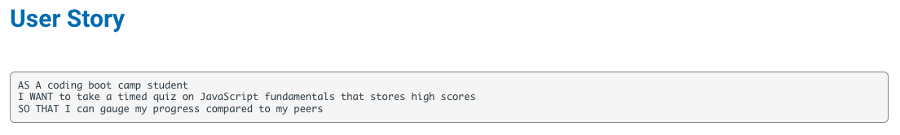
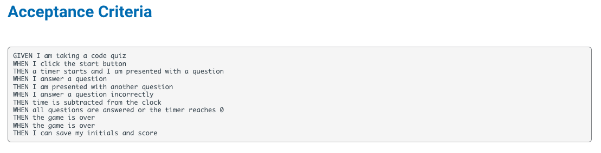

# Timed JavaScript Quiz

## Deployed Site
https://elawilliam.github.io/timed-javascript-quiz/

## Description
This is a timed coding quiz with multiple choice questions. The application runs in the brower and features dynamically updated HTML and CSS powered by JavaScript. It has a clean, polished and responsive user interface.

## Usage
Intended for users looking to take a timed quiz to practice their JavaScript knowledge.

## Mock-Up

## License
Please see license information outlined in the repository.
